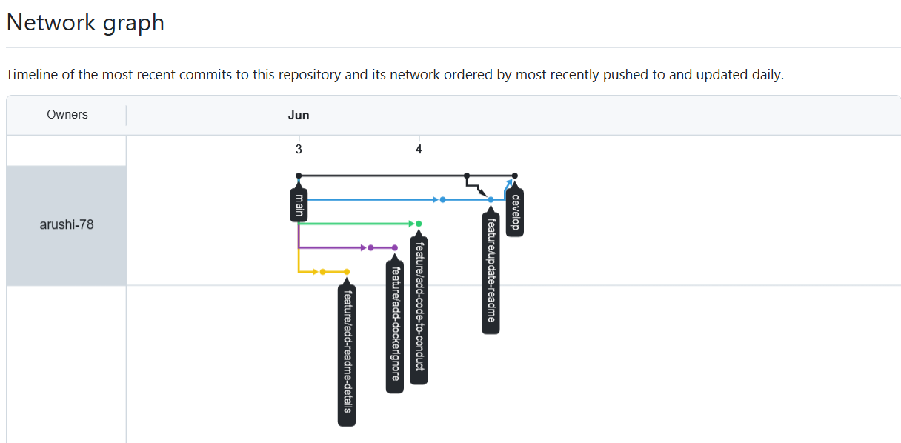
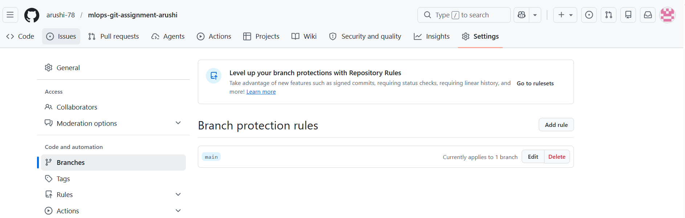
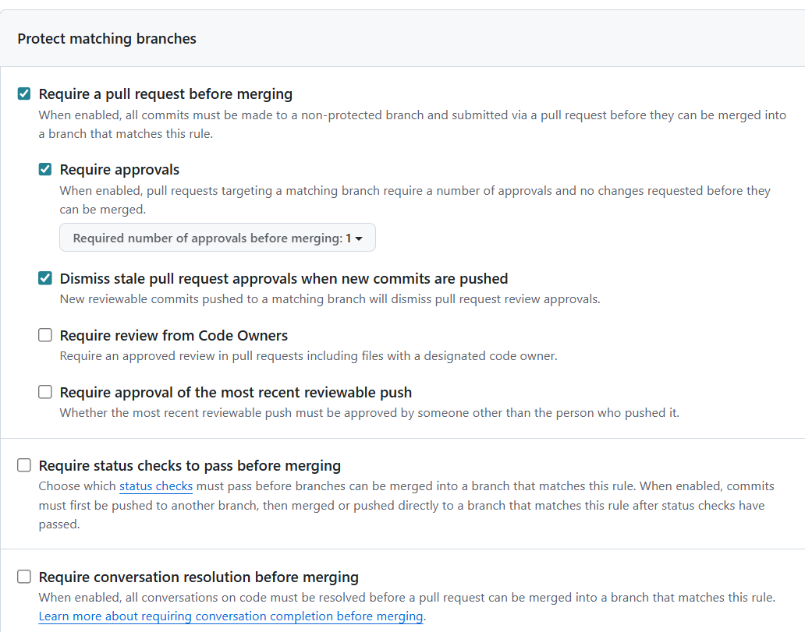
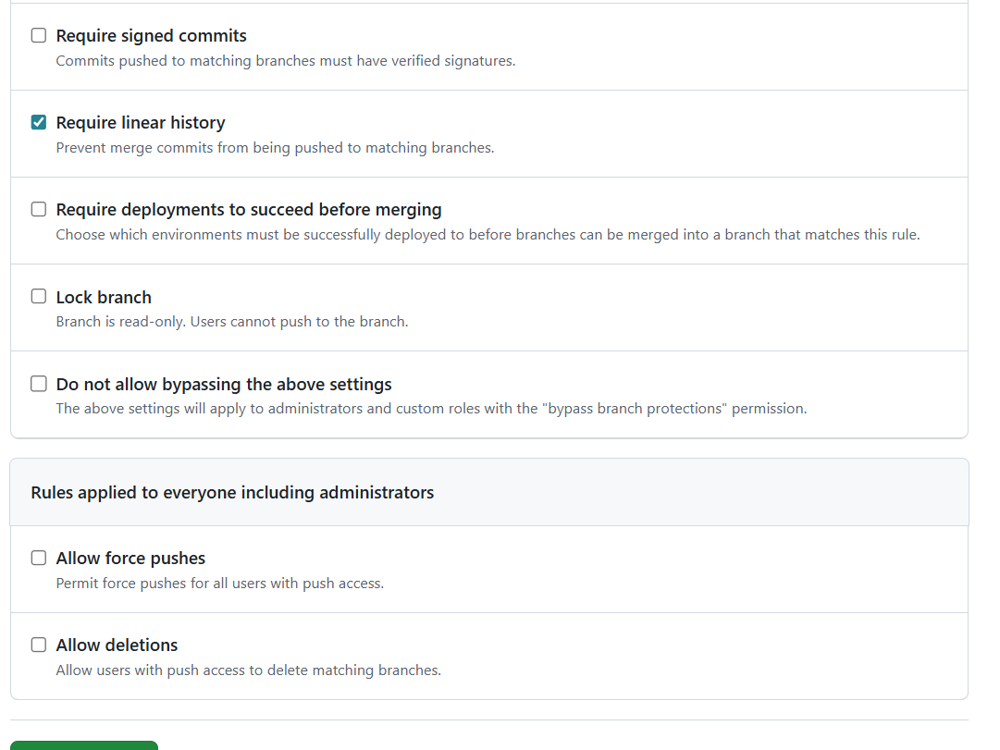
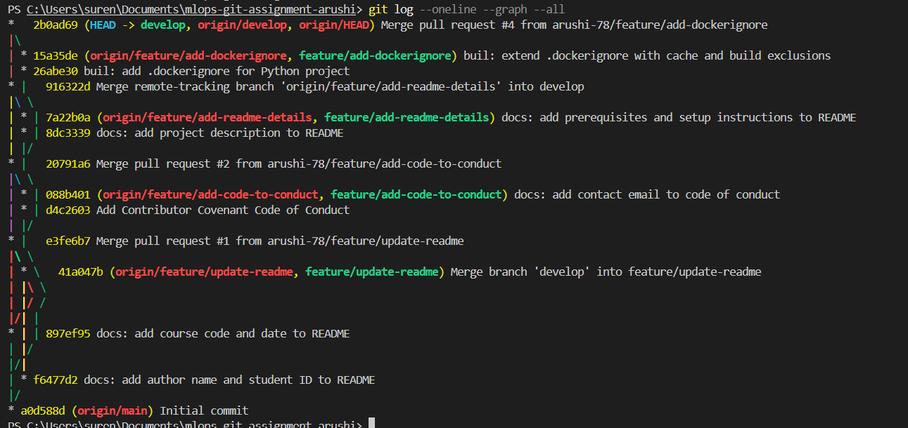

# Assignment 1 Report — Git Branching & Collaboration

**Course:** MAI201 MLOps
**Repository:** https://github.com/arushi-78/mlops-git-assignment-arushi

---

## 1. Network Graph

The GitHub network graph below shows all branches (`main`, `develop`, and the
four feature branches) and how they were merged back into `develop`.



---

## 2. Branch Protection Rules

A branch protection rule is configured for the `main` branch with the following
settings:

- Require a pull request before merging
- Require at least one approval (required approvals = 1)
- Dismiss stale pull request approvals when new commits are pushed
- Require linear history
- Force pushes disabled (*Allow force pushes* left unchecked)
- Branch deletion disabled (*Allow deletions* left unchecked)







---

## 3. `git log --oneline --graph`

```
*   2b0ad69 (HEAD -> develop, origin/develop, origin/HEAD) Merge pull request #4 from arushi-78/feature/add-dockerignore
|\
| * 15a35de (origin/feature/add-dockerignore, feature/add-dockerignore) build: extend .dockerignore with cache and build exclusions
| * 26abe30 build: add .dockerignore for Python project
* |   916322d Merge remote-tracking branch 'origin/feature/add-readme-details' into develop
|\ \
| * | 7a22b0a (origin/feature/add-readme-details, feature/add-readme-details) docs: add prerequisites and setup instructions to README
| * | 8dc3339 docs: add project description to README
| |/
* |   20791a6 Merge pull request #2 from arushi-78/feature/add-code-to-conduct
|\ \
| * | 088b401 (origin/feature/add-code-to-conduct, feature/add-code-to-conduct) docs: add contact email to code of conduct
| * | d4c2603 Add Contributor Covenant Code of Conduct
| |/
* |   e3fe6b7 Merge pull request #1 from arushi-78/feature/update-readme
|\ \
| * \   41a047b (origin/feature/update-readme, feature/update-readme) Merge branch 'develop' into feature/update-readme
| |\ \
| |/ /
|/| |
* | | 897ef95 docs: add course code and date to README
| |/
|/|
| * f6477d2 docs: add author name and student ID to README
|/
* a0d588d (origin/main) Initial commit
```



---

## 4. Reflection: Challenges in Resolving Merge Conflicts

The merge conflict in this assignment arose because two branches edited the same
region of `README.md`: `feature/update-readme` added my name and student ID
directly under the title, while `develop` independently added the course code and
date in the same place. Because both edits touched overlapping lines, Git could
not auto-merge them and surfaced a conflict.

The first challenge was conceptual. I had to realise that a conflict only occurs
when changes overlap on the same (or immediately adjacent) lines. My first
instinct was to place the two edits in genuinely "different locations" as the
brief literally says — but doing that would have let Git merge them automatically
with nothing to resolve. To produce a real conflict I had to deliberately make
both edits land in the same section of the file.

The second challenge was reading the conflict markers correctly. Seeing
`<<<<<<<`, `=======`, and `>>>>>>>` for the first time is disorienting — it is
easy to delete the wrong block or leave a stray marker behind, which silently
breaks the file. I learned to treat the section between `<<<<<<<` and `=======`
as my branch's version and the section between `=======` and `>>>>>>>` as the
incoming version.

The third challenge was deciding on the resolution. The requirement was to
preserve both changes, so "accept current" or "accept incoming" on their own were
both wrong — I needed to keep both lines and remove all three marker lines. I
resolved it in VS Code using **Accept Both Changes**, then verified that the file
contained both the author line and the course line, with no leftover markers,
before committing the merge.

The main takeaway is that a merge conflict is not an error but a prompt for a
human decision. Git is asking which intent should win, and when both edits are
valid, the right answer is to combine them thoughtfully rather than discard
either one.
